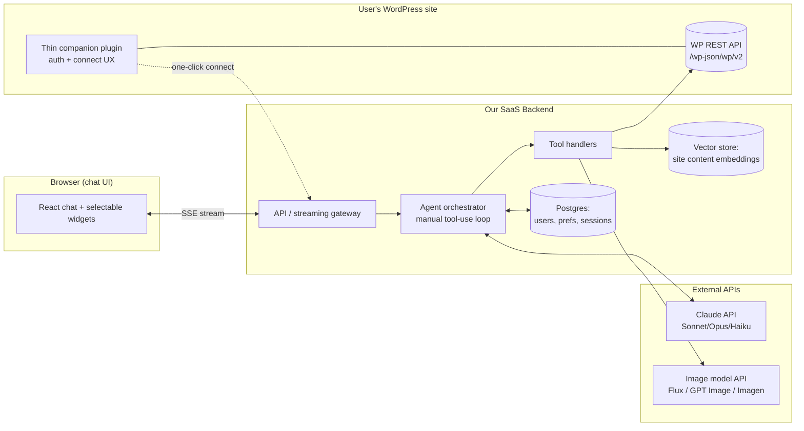

# Technical Design Doc — AI Blog Co-Author for WordPress

**Status:** Draft v0.1
**Author:** rdaichi27
**Last updated:** 2026-05-28

---

## 1. Summary

A ChatGPT-style conversational agent that helps a (typically non-technical) user
go from *"I want to write a blog about X"* to a **published WordPress post**,
entirely through chat. The agent walks the user through the decisions — topic,
angle, outline, tone, SEO, featured image, scheduling — and then **actually
performs the publish** by calling the WordPress REST API. It is not a text box
that hands you a blob to copy-paste; it closes the loop.

The defensible value (see §3) is **not** "the AI remembers your prompt." It is
(a) the agent is **grounded in the user's own site** (existing posts, categories,
tags, brand voice → no duplicate topics, automatic internal linking, on-brand
output), and (b) it executes a **reliable, zero-configuration publish pipeline**
(Gutenberg formatting + media upload + SEO meta + scheduling) for people who will
never touch an API key.

---

## 2. Goals & Non-Goals

### Goals
- Conversational creation **and** publishing of a single high-quality post.
- Guided, opinionated workflow with human checkpoints (no silent auto-publish).
- Ground generation in the user's actual site content.
- Persist per-user brand voice / preferences across sessions.
- Work for **self-hosted WordPress.org** sites (the largest, least-served market).

### Non-Goals (v1)
- Changing the site's **visual theme**. ⚠️ This is *not possible via the REST API*
  (the `/wp/v2/themes` route is read-only; switching requires server-side
  `switch_theme()`, i.e. a plugin). If "theme" in the brief meant the *post's
  topic/style*, that's just conversation and is in scope. If it meant the
  WordPress visual theme, it is **out of scope for v1** — see §15.
- Bulk / autoblogging (generate 100 posts overnight). Deliberately avoided to dodge
  the spam-content reputation; possible later via the Batch API.
- Full WYSIWYG page-builder editing (Elementor/Divi-style layouts).
- Multisite management UI (each subsite connects individually).

---

## 3. Value Proposition — "Why not just use ChatGPT and copy-paste?"

This question deserves an honest answer, because the obvious version of this
product is **already partly solved by free tooling**. The design is shaped by
surviving that scrutiny.

### What the alternatives already do (the threat)
- **GPT Actions** let a Custom GPT call external REST APIs (read *and* write). A
  public tutorial already shows a Custom GPT publishing to WordPress via
  `/wp-json/wp/v2/posts` + Application Passwords. → "It publishes" is *not* a moat.
- **Claude connectors / MCP** do the same.
- **ChatGPT Memory + Custom Instructions + Projects** (and Claude Projects)
  already give "a preset prompt + persistent preferences that survive sessions."
  → The "persistent preset prompt" argument is **weak** and should be dropped as a
  headline.
- **AI Engine** (a WordPress plugin, ~100K installs) already ships a built-in MCP
  server letting Claude/ChatGPT publish into WordPress. → The thin-wrapper niche is
  *already occupied*.
- **WordPress.com AI Agents** (launched 2026-03) do conversational write-and-publish
  via MCP — but **hosted .com only**, not self-hosted .org.

### The genuinely defensible differentiators (ranked)
1. **Grounding in the user's own site (strongest).** RAG over existing posts,
   taxonomy, and learned brand voice → avoids duplicate topics, links internally,
   matches house style. A generic Custom GPT has none of this; copying it requires
   real retrieval infrastructure, not a prompt. Compounds with usage.
2. **Reliable, zero-config last mile.** Not "it *can* POST" (incumbents can) but the
   *non-technical* version: one OAuth-style click, no Application Password paste, no
   OpenAPI schema, plus correct Gutenberg block markup, image gen + media upload +
   alt text, featured image, and scheduling that *just works*.
3. **Multi-tool orchestration** as one coordinated pipeline (SEO meta, image, alt
   text, internal links, categories, schedule).
4. **Quality control** via versioned templates, brand-voice checks, dedup/fact guards.
5. **Opinionated guided UX** for non-technical bloggers — high value but low
   defensibility (UX is cloneable).
6. **Cost/model control** (BYO key or pooled, per-task model routing).

### Honest conclusion
Differentiate on **#1 (site grounding)** and **#2 (reliable zero-config pipeline)**.
If we ship only the thin wrapper, AI Engine and the platform vendors already win.
For a single power user, a free Custom GPT genuinely is good enough — our wedge is
non-technical bloggers on **self-hosted .org** who want an opinionated co-author that
knows *their* site. That niche is currently underserved (Automattic's agent is
.com-only; everyone else ships inline "improve this paragraph" buttons or one-shot
bulk generators).

---

## 4. Competitive Landscape (condensed)

| Tool | Form | Chat? | Publishes? | Notes |
|---|---|---|---|---|
| WordPress.com AI Agents | Hosted (MCP) | Yes | Yes | **Closest threat**, but .com-only |
| AI Engine (Meow Apps) | Plugin (+MCP) | Yes | Yes | ~100K installs; dev/visitor-bot oriented, BYO key |
| GetGenie | Plugin + SaaS | Partial (GenieChat) | Drafts | Templates + SERP research, ~$20–99/mo |
| Bertha AI | Plugin + ext. | Chat module | Drafts | Templates, DALL·E images |
| Jetpack AI | Plugin | Inline-ish | In-editor | Editor-toolbar driven |
| Rank Math / Yoast / AIOSEO | SEO plugins | Assistant/inline | Meta only | SEO-anchored, not full author flow |
| Elementor / Divi AI | Builder | Inline | In-builder | Design-focused |
| Autoblogging tools | Plugin/SaaS | No | Yes (bulk) | One-shot/batch, spam reputation |

**Gap:** a guided, conversational **author-and-publish** agent for **self-hosted
WordPress.org**, with human checkpoints. Market WTP is real but modest (content AI
clusters at ~$10–20/mo; buyers dislike opaque token metering).

---

## 5. System Architecture

**Chosen model: Hybrid** — a thin WordPress companion plugin for onboarding/auth,
plus an external SaaS backend that holds the AI keys and does all generation.

Rationale: a pure plugin would force our AI API keys onto thousands of untrusted
sites (unacceptable), while pure SaaS makes onboarding painful (manual Application
Password paste). Hybrid gives easy onboarding *and* secure key custody.



---

## 6. Core Components

### 6.1 Agent orchestrator (the agentic loop)
A **manual** tool-use loop (not an auto tool-runner) so we control human-in-the-loop
gating:
1. Call Claude `messages.create` with `tools` + full history.
2. If `stop_reason == "tool_use"`: append the assistant turn, execute the tool(s),
   append `tool_result` block(s) (matched by `tool_use_id`), loop.
3. Break on `end_turn`.
4. On tool failure → return `tool_result` with `is_error: true` and a useful
   message; Claude adapts or asks the user instead of crashing.

**Confirmation gate (key requirement):** hard-to-reverse / user-visible actions
(`publish`, `schedule_post`, `create_draft` going live) are **not auto-executed**.
When Claude emits the `tool_use`, the orchestrator pauses and renders the proposed
action in the UI ("Publish to *Marketing*, scheduled Tue 9am?"); the WP call runs
only after the user confirms. Read-only tools (`search_existing_posts`,
`list_categories`) run automatically.

### 6.2 Tool layer (WordPress actions)
Keep the set small and well-described (descriptions are how Claude decides when to
call them; use `enum`s for fixed values; validate inputs in each handler).

| Tool | Maps to | Gated? |
|---|---|---|
| `search_existing_posts(query)` | `GET /wp/v2/posts?search=` + vector search | auto |
| `list_categories()` / `list_tags()` | `GET /wp/v2/categories` / `/tags` | auto |
| `propose_outline(sections[])` | structured output → UI checkboxes | auto |
| `generate_image(prompt)` | external image API | confirm prompt |
| `create_draft(title, content_blocks, status="draft")` | `POST /wp/v2/posts` | gate |
| `upload_media(image)` | `POST /wp/v2/media` → media id | gate |
| `set_featured_image(post_id, media_id)` | `featured_media` on post | gate |
| `set_categories(post_id, ids[])` / `set_tags(...)` | post taxonomy arrays | gate |
| `schedule_post(post_id, date_iso)` | `status="future"` + `date` | **confirm** |
| `publish_post(post_id)` | `status="publish"` | **confirm** |

**Ordering constraint:** media is associated *after* the post exists (needs the post
id), so `create_draft` precedes `upload_media`/`set_featured_image`.

### 6.3 WordPress integration
- **Auth:** Application Passwords (WP core ≥5.6, HTTP Basic over HTTPS) via the
  **authorize-application redirect flow** (`/wp-admin/authorize-application.php?...`)
  so the user clicks one "Approve" button instead of pasting a 24-char string. The
  companion plugin can pre-fill / smooth this. WordPress.com sites use **OAuth2**
  against `public-api.wordpress.com` (v2+).
- **Content format:** generate **Gutenberg block markup** (HTML wrapped in
  `<!-- wp:paragraph -->…<!-- /wp:paragraph -->` delimiters), *not* raw HTML, so the
  post stays natively editable in the block editor.
- **Images:** two-step — `POST /wp/v2/media` (binary body + `Content-Disposition:
  attachment; filename=...`) returns an id → set as `featured_media` or insert a
  `wp:image` block.
- **Scheduling:** `status="future"` + future `date` in site timezone.

### 6.4 Site context / grounding (the moat)
On connect (and on a refresh cadence), pull and embed the user's content:
- `GET /wp/v2/posts?per_page=100&_fields=id,title,link,categories,tags,excerpt`
  (paginate via `X-WP-TotalPages`; `per_page` max 100).
- `GET /wp/v2/categories`, `/tags`, `/settings`.
Store embeddings in the vector store. Used for: duplicate-topic detection, category
matching, internal-link suggestions, and brand-voice inference.

### 6.5 Memory / brand-voice persistence
The Messages API is **stateless** — we resend full history each turn. Persistence
strategies:
- **System prompt:** frozen agent persona + WP action protocol + tool list (cached).
- **Per-user preferences** (tone, audience, banned words, default category): stored
  in *our* Postgres, injected into the system prompt at session start.
- Optional **Memory tool** (`/memories` backend we own) for preferences Claude learns
  and refines across chats.

### 6.6 Image generation
Claude does not generate images. A `generate_image` handler calls a dedicated image
API, then pipes bytes into `upload_media` → `set_featured_image`. Default: **Flux 2
Pro** (best price/quality for blog visuals, ~$0.02–0.12/image); **GPT Image 1.5** if
legible in-image text is needed; self-host Stable Diffusion to avoid per-image fees.

### 6.7 Proactive Content Intelligence (the differentiating layer)

The bot does not only respond — it maintains a **living model of the site** and uses
it to advise. These behaviors are what make it "optimized solely for AI blogs" rather
than a generic chat:

| Behavior | What it does | Data it needs | Trigger |
|---|---|---|---|
| **Gap detection** | "You have 12 posts on email marketing but nothing on deliverability." | Per-category/topic coverage counts + (optional) external SEO demand | On-demand + background |
| **Duplicate / overlap guard** | Before drafting: "You already covered this in *X* — fresh angle or update it?" | Semantic similarity vs. existing posts | On-demand (pre-draft) |
| **Content refresh** | Flags stale or traffic-declining posts to update | Post dates + (later) analytics | Background scan |
| **Auto internal-linking** | For each draft, surfaces the most related existing posts and links them | Semantic neighbors + their URLs | Per-draft |
| **Topic clusters / series** | Proposes a pillar + cluster plan, not one-off posts | Topic graph over the corpus | On-demand |
| **Cadence nudges** | "It's been 3 weeks — here are 3 gap-filling ideas ready to draft." | Coverage gaps + last-post date | Scheduled job |

**Why generic ChatGPT cannot do this (verified May 2026):** ChatGPT has scheduled
*Tasks* (timer-based proactivity) and an agent that can browse on request, but it has
**no persistent, auto-synced semantic index of your site**. Custom GPT "knowledge" is
a manual upload — max 20 files, a static snapshot, no sync when you publish. So the
proactive *combination* — a continuously-synced model of your corpus that drives
dedup, gap analysis, and internal linking — is structurally outside what the consumer
products do. That combination is the moat, not any single behavior.

### 6.8 Retrieval & Data Architecture (where the real cost is)

A key correction to the intuition that "scanning all N posts is the problem":

**There are two different costs, and they are not the same one.**
- **Database/CPU runtime** — scanning N posts. A blog's N is tens to low thousands;
  even a brute-force O(N) scan is sub-millisecond. **This is not the bottleneck and is
  not worth optimizing.**
- **AI token cost** — every post you put into the model's context costs tokens, and
  that is where the money goes. So the goal of retrieval is to feed Claude **only the
  top-k relevant posts**, never all N.

The instinct "don't send everything" is right — but for *token* reasons, and the
mechanism is **top-k retrieval**, not a hand-built hashtable.

**Hybrid retrieval (use both):**
1. **Structured filters (category/tag) = your "buckets."** But you don't build a
   hashtable — Postgres B-tree/GIN indexes *are* the optimized lookup, for free. Great
   as a cheap pre-filter and for aggregates (gap analysis = `GROUP BY category`).
2. **Semantic vector search = what buckets can't do.** "Is this new idea similar to
   something I already wrote?" is a *meaning* question; near-duplicates routinely sit
   in different categories, so category buckets alone miss them. Embed posts, store as
   vectors, query by cosine similarity (top-k).

**Pipeline:** on connect/update → fetch posts via WP REST → compute each post's
embedding **once** (cache it; recompute only when the post is edited) → store a row
`{post_id, title, url, category_ids, tags, excerpt, embedding}`. At query time: embed
the query once (cheap), optional category pre-filter, vector top-k (k ≈ 5–10), send
only those snippets to Claude.

**Note — embeddings need their own model.** Claude has no embeddings endpoint; use a
dedicated embedding model (Voyage AI is Anthropic's recommended partner; OpenAI's
`text-embedding-3-small` or an open-source model also work). Embeddings are cheap
(fractions of a cent per post) and are a one-time-per-post cost.

**Supabase fit:** yes, a good choice. It's managed **Postgres + pgvector** (vector
column + HNSW/IVFFlat ANN indexes) plus auth, storage, row-level security, and edge
functions — so it covers the relational DB *and* the vector store in one service; no
separate vector DB needed. But "is it already optimized?" — it gives you the optimized
*building blocks*; you still create the right indexes and schema. At single-blog scale
you may not even need an ANN index (exact search is fine); add HNSW when you scale to
agencies/multi-site. Keep AI keys server-side (edge functions), never client-side —
RLS protects rows, not secrets.

**Cost levers, ranked:** (1) prompt caching on Claude (system+tools prefix ≈ 0.1× on
reads), (2) top-k retrieval instead of all-N (token reduction), (3) embed once & reuse,
(4) model routing (Haiku for cheap classification helpers, Sonnet main, Opus rare),
(5) Batch API (50% off) for background bulk work.

---

## 7. Conversation Flow (guided UX)

```
Idea  →  Angle/audience  →  Outline (approve)  →  Draft  →  SEO (title/meta/slug)
      →  Featured image (approve)  →  Categories/tags  →  Review  →  Publish/Schedule
```

- Each step that produces choices (3 angles, outline sections, title options, tags)
  uses **structured output** so the UI renders selectable widgets; the selection
  feeds the next turn.
- Conversational prose is **streamed** token-by-token.
- The grounding layer is consulted silently (e.g. "You already covered this in *X*
  — want a different angle or an update to that post?").
- Publish and schedule require explicit confirmation.

---

## 8. AI / Model Strategy

- **Model routing** (cost lever):
  - **Sonnet 4.6** — main orchestration + drafting (strong writing, far cheaper than Opus).
  - **Opus 4.7** — reserved for genuinely hard reasoning (complex SEO strategy, long-form structuring).
  - **Haiku 4.5** — cheap helpers (tag suggestion, classification, dedup ranking, title shortening) via *separate* sub-calls.
  - ⚠️ Switching the model on the *main* loop invalidates the prompt cache — route by spawning sub-calls, don't swap mid-conversation.
- **Prompt caching** (essential): prefix-match over `tools → system → messages`.
  Put a `cache_control` breakpoint on the last system block (caches tools+system) and
  one on the latest turn. Reads ≈0.1× input price; writes ≈1.25× (5-min TTL). **Keep
  the system prompt byte-frozen** — never interpolate `now()`, user id, or session
  token into it. Verify hits via `usage.cache_read_input_tokens`.
- **Streaming:** `messages.stream()` for the chat (also avoids long-generation
  timeouts). Inspect the final message each iteration to extract complete tool-use
  blocks before executing.
- **Structured output:** `output_config.format = json_schema` for "return 3 angles as
  an array" type responses, or `strict: true` on a tool for guaranteed-valid params.
- **Batch API** (50% off) reserved for any future non-interactive bulk work.

---

## 9. Data Model (sketch)

- `users` — id, email, plan, billing.
- `wp_connections` — user_id, site_url, auth_type (app_pw | oauth), encrypted
  credentials, host_type (org | com), last_synced_at.
- `preferences` — user_id, brand_voice, audience, banned_words, default_category,
  default_author.
- `sessions` / `messages` — conversation history (with tool_use/tool_result blocks
  preserved verbatim).
- `site_content_index` — vector store: post_id, title, embedding, categories, tags,
  excerpt, url.
- `drafts` — local mirror of in-progress posts before they exist on WP (status,
  blocks, chosen image, SEO meta).

### 9.1 Concrete Supabase schema (DDL)

Supabase auth provides `auth.users`; app tables reference it. `user_id` is
**denormalized onto child tables** so row-level-security policies stay a simple
`auth.uid() = user_id` check instead of multi-table joins. Credentials are stored as
ciphertext (use Supabase Vault / pgsodium, or encrypt in the app layer) — never
plaintext.

```sql
-- Extensions
create extension if not exists vector;      -- pgvector
create extension if not exists pgcrypto;    -- gen_random_uuid()

-- Profile (1:1 with auth.users)
create table profiles (
  id          uuid primary key references auth.users(id) on delete cascade,
  email       text,
  plan        text not null default 'free',
  created_at  timestamptz not null default now()
);

-- One row per connected WordPress site
create table wp_connections (
  id                    uuid primary key default gen_random_uuid(),
  user_id               uuid not null references auth.users(id) on delete cascade,
  site_url              text not null,
  host_type             text not null check (host_type in ('org','com')),
  auth_type             text not null check (auth_type in ('app_password','oauth')),
  wp_username           text,
  credentials_encrypted text not null,          -- ciphertext only
  last_synced_at        timestamptz,
  created_at            timestamptz not null default now(),
  unique (user_id, site_url)
);

-- Per-site brand voice / preferences (injected into the system prompt)
create table preferences (
  connection_id      uuid primary key references wp_connections(id) on delete cascade,
  user_id            uuid not null references auth.users(id) on delete cascade,
  brand_voice        text,
  target_audience    text,
  tone               text,
  banned_words       text[] default '{}',
  default_category_id int,
  default_author_id   int,
  updated_at         timestamptz not null default now()
);

-- Living index of the site's existing content (the grounding layer)
create table site_content_index (
  id            uuid primary key default gen_random_uuid(),
  user_id       uuid not null references auth.users(id) on delete cascade,
  connection_id uuid not null references wp_connections(id) on delete cascade,
  wp_post_id    bigint not null,
  title         text,
  url           text,
  excerpt       text,
  category_ids  int[]  default '{}',
  tags          text[] default '{}',
  status        text,
  published_at  timestamptz,
  content_hash  text,                 -- re-embed only when this changes
  embedding     vector(1536),         -- 1536 = OpenAI text-embedding-3-small;
                                       -- use vector(1024) for Voyage voyage-3
  updated_at    timestamptz not null default now(),
  unique (connection_id, wp_post_id)
);

-- Chat sessions + messages (history resent to Claude each turn)
create table sessions (
  id            uuid primary key default gen_random_uuid(),
  user_id       uuid not null references auth.users(id) on delete cascade,
  connection_id uuid references wp_connections(id) on delete set null,
  title         text,
  created_at    timestamptz not null default now()
);

create table messages (
  id          uuid primary key default gen_random_uuid(),
  session_id  uuid not null references sessions(id) on delete cascade,
  user_id     uuid not null references auth.users(id) on delete cascade,
  seq         int  not null,                       -- ordering within a session
  role        text not null check (role in ('user','assistant','tool')),
  content     jsonb not null,        -- preserves tool_use / tool_result blocks verbatim
  created_at  timestamptz not null default now(),
  unique (session_id, seq)
);

-- Local draft mirror before/while it exists on WordPress
create table drafts (
  id               uuid primary key default gen_random_uuid(),
  user_id          uuid not null references auth.users(id) on delete cascade,
  session_id       uuid references sessions(id) on delete set null,
  connection_id    uuid not null references wp_connections(id) on delete cascade,
  wp_post_id       bigint,                -- null until created on WP
  title            text,
  content_blocks   text,                  -- Gutenberg block markup
  excerpt          text,
  seo_title        text,
  seo_meta         text,
  slug             text,
  featured_media_id   bigint,
  featured_image_url  text,
  category_ids     int[]  default '{}',
  tags             text[] default '{}',
  status           text not null default 'draft'
                     check (status in ('draft','ready','scheduled','published')),
  scheduled_for    timestamptz,
  created_at       timestamptz not null default now(),
  updated_at       timestamptz not null default now()
);
```

**Indexes** (the part that makes retrieval cheap):

```sql
-- Semantic search over post embeddings (cosine). HNSW = sub-linear ANN.
create index on site_content_index using hnsw (embedding vector_cosine_ops);

-- "Bucket" pre-filters and gap-analysis aggregates
create index on site_content_index using gin (category_ids);
create index on site_content_index using gin (tags);
create index on site_content_index (connection_id);

-- Fast history load
create index on messages (session_id, seq);
```

> At single-blog scale exact search is already fast; the HNSW index matters once you
> serve agencies/multi-site. `category_ids`/`tags` GIN indexes are the real "hashtable"
> — you don't hand-roll buckets.

**Vector search RPC** (call from the client via `supabase.rpc('match_site_content', …)`;
combines an optional category pre-filter with cosine top-k):

```sql
create or replace function match_site_content(
  p_connection_id uuid,
  p_query_embedding vector(1536),
  p_match_count int default 8,
  p_filter_category int default null
)
returns table (wp_post_id bigint, title text, url text, excerpt text, similarity float)
language sql stable as $$
  select s.wp_post_id, s.title, s.url, s.excerpt,
         1 - (s.embedding <=> p_query_embedding) as similarity
  from site_content_index s
  where s.connection_id = p_connection_id
    and (p_filter_category is null or p_filter_category = any(s.category_ids))
  order by s.embedding <=> p_query_embedding   -- <=> = cosine distance
  limit p_match_count;
$$;
```

**Row-level security** (every table — users see only their own rows):

```sql
alter table wp_connections     enable row level security;
alter table preferences        enable row level security;
alter table site_content_index enable row level security;
alter table sessions           enable row level security;
alter table messages           enable row level security;
alter table drafts             enable row level security;

-- Pattern, repeat per table (uses the denormalized user_id):
create policy "own rows" on site_content_index
  for all using (auth.uid() = user_id) with check (auth.uid() = user_id);
```

**Gap analysis** is then a plain aggregate, no AI tokens spent:

```sql
select unnest(category_ids) as category_id, count(*) as posts
from site_content_index
where connection_id = $1
group by 1 order by posts asc;   -- thinnest categories surface first
```

---

## 10. Security

- **AI keys never leave our backend** — the plugin holds none.
- WP credentials **encrypted at rest**; Application Passwords are per-app and
  revocable, require HTTPS, and cannot log into the dashboard.
- Treat tool inputs as untrusted; validate/parse (`JSON.parse`/schema) — never
  string-match model output into a request.
- Confirmation gate prevents accidental publish.
- Detect **REST API blocked/disabled** (Wordfence/Solid/host hardening) during
  onboarding and surface a clear, actionable error.
- Rate-limit/backoff on the WP side (core has no rate limit, but hosts/plugins do;
  WordPress.com throttles).
- Prompt-injection: content fetched from the user's own site is comparatively
  trusted, but still sandbox it from the system prompt and never let fetched content
  trigger un-gated actions.

---

## 11. Cost Model (rough, per published post)

- Conversation + drafting on Sonnet 4.6 with prompt caching: small $ per post
  (caching cuts the repeated system/tool prefix to ~0.1×).
- One image: ~$0.02–0.12.
- Helper Haiku calls: negligible.
- Pricing options to test: flat tier (~$15–25/mo) vs **BYO-API-key** (beats
  token-metering fatigue — a recurring complaint about incumbents).

---

## 12. Recommended Tech Stack

- **Frontend:** React (Next.js) chat UI with SSE streaming + selectable-widget
  components.
- **Backend:** Node/TypeScript (Anthropic TS SDK; first-class streaming). Python +
  FastAPI is an equally valid alternative if the team prefers it.
- **Datastores:** Postgres (state) + a vector store (pgvector or a managed service).
- **WordPress companion plugin:** thin PHP — handles the connect/authorize UX and a
  health check; holds **no** AI keys.
- **Image:** Flux 2 Pro API (swappable behind the `generate_image` handler).

---

## 13. Phased Roadmap

- **MVP (v0):** self-hosted .org only; Application Password connect; single-post flow
  (idea → outline → draft → publish/schedule); Gutenberg formatting; manual category
  selection; no image gen; Sonnet only; basic prompt caching.
- **v1:** site grounding (dedup + internal links + category matching); featured image
  generation + upload; SEO meta; brand-voice persistence; confirmation gates polished.
- **v2:** WordPress.com (OAuth2); model routing + Haiku helpers; templates & evals;
  multi-site; analytics.
- **v3 (maybe):** batch/scheduled content calendars; theme/design assistance (needs
  server-side plugin code, see §15).

---

## 14. Open Questions / Risks

- **Platform risk:** OpenAI/Anthropic and Automattic keep absorbing wrapper features
  (Actions, MCP, memory). Our moat must be grounding + reliability, not primitives.
- **Onboarding friction** on self-hosted: even the redirect flow asks non-technical
  users to approve an app — measure drop-off.
- **REST API reliability** across the long tail of hosts/security plugins.
- **"Theme" ambiguity** in the brief (see §15) — needs a product decision.
- BYO-key vs pooled-key pricing — affects unit economics and onboarding.
- Quality bar vs AI Engine / WordPress.com agent: we must be *materially* better on
  the two moats or there's no reason to switch.

---

## 15. Decision needed: what does "theme" mean?

The brief says the bot offers *"theme can be this and gives options."* Two readings:
- **Post topic / style / tone** → just conversation, already core to the flow. ✅
- **WordPress visual theme** → **cannot be changed via the REST API** (themes route
  is read-only; switching requires server-side `switch_theme()`, i.e. our companion
  plugin would need a custom endpoint). This is a v3 feature at earliest. ❗

Recommend confirming this before scoping. v1 assumes the first reading.

---

## 16. References

WordPress: [Posts](https://developer.wordpress.org/rest-api/reference/posts/) ·
[Media](https://developer.wordpress.org/rest-api/reference/media/) ·
[Authentication](https://developer.wordpress.org/rest-api/using-the-rest-api/authentication/) ·
[App Passwords integration](https://make.wordpress.org/core/2020/11/05/application-passwords-integration-guide/) ·
[Themes (read-only)](https://developer.wordpress.org/rest-api/reference/themes/) ·
[WordPress.com OAuth2](https://developer.wordpress.com/docs/api/oauth2/)

Claude API: [Tool use](https://platform.claude.com/docs/en/agents-and-tools/tool-use/overview) ·
[Prompt caching](https://platform.claude.com/docs/en/build-with-claude/prompt-caching) ·
[Streaming](https://platform.claude.com/docs/en/build-with-claude/streaming) ·
[Structured outputs](https://platform.claude.com/docs/en/build-with-claude/structured-outputs) ·
[Models](https://platform.claude.com/docs/en/about-claude/models/overview)

Market: [WordPress.com AI Agents (TechCrunch)](https://techcrunch.com/2026/03/20/wordpress-com-now-lets-ai-agents-write-and-publish-posts-and-more/) ·
[AI Engine](https://wordpress.org/plugins/ai-engine/) ·
[Custom GPT → WordPress tutorial](https://jonbishop.com/guides/build-a-chatgpt-custom-gpt-that-creates-and-searches-wordpress-posts-using-the-rest-api/)
